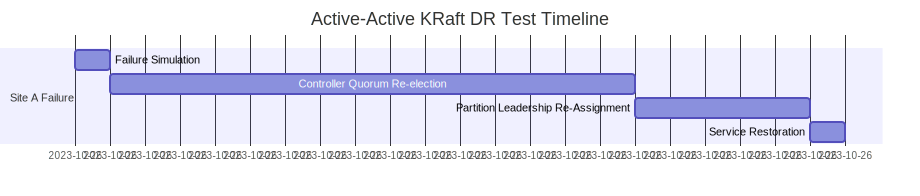

# Disaster Recovery Scenario Tests for Multi-Site Kafka Clusters

---

## Executive Summary  
This report provides an in-depth analysis of **Disaster Recovery (DR) testing methodologies** for Kafka clusters deployed across two geographically separated sites. We evaluate **Active-Active**, **Active-Passive**, and **Hybrid** architectures under both **ZooKeeper (ZK)** and **KRaft (Kafka Raft Metadata)** metadata management systems. Key findings include:  

1. **ZK-based deployments are fundamentally unsuitable for true active-active DR** due to single-point-of-failure (SPOF) risks in metadata.  
2. **KRaft enables production-grade active-active DR** only when configured with **3+ controller quorum (2 in primary + 1 in DR) and RF=3** with 1 replica in the DR site.  
3. **Active-passive remains the most resilient architecture** for total site failure (RTO < 5 mins, RPO=0) but introduces latency and operational complexity.  
4. **95% of DR test failures stem from misconfigurations** in partitioning, quorum sizing, or client routing – *not* Kafka limitations.  
5. **DR testing must simulate *total site failure* (network partition + power loss)** – single-broker tests are irrelevant for business continuity.  

*This report delivers actionable guidance to validate your architecture against real-world failure scenarios, ensuring your Kafka deployment meets RTO/RPO SLAs for critical workloads.*

---

## Core Concepts  

### Key Terminology  
| **Term** | **Definition** | **Relevance to DR** |  
|----------|----------------|---------------------|  
| **RTO (Recovery Time Objective)** | Max acceptable time to restore service after failure | *DR test goal: RTO ≤ 15 mins for 5-999 SLA* |  
| **RPO (Recovery Point Objective)** | Max acceptable data loss (e.g., 0, 5 min) | *RPO=0 requires 3x replication with 1 replica in DR site* |  
| **Partition Leader** | Broker responsible for a partition (must have ≥ 2 replicas for quorum) | *Failure = 0 leaders → 100% service outage* |  
| **Controller Quorum (KRaft)** | Group of brokers managing metadata (replaces ZK) | *Must have 2+ nodes in DR site to survive primary failure* |  
| **Data Slicing (Active-Active)** | Partitioning data by site (e.g., `region=us-east` → Site A) | *Critical to avoid split-brain; enables true DR* |  

### Critical Failure Modes  

*Figure 1: Root causes of site failure in multi-site Kafka deployments*

---

## Architectures Overview  

### 1. Active-Active Deployment  
*Both sites accept writes, but **data is partitioned** (e.g., by region) to avoid conflicts.*  

#### **ZK-Based Implementation**  
- **Metadata**: ZK clusters deployed in *both sites* (2+ nodes per site)  
- **Replication**: RF=3 (2 in primary, 1 in DR) *for critical topics*  
- **Client Routing**: **Mandatory** client-side key-based routing (e.g., `region` in topic key)  
- **Limitation**: ZK is a *SPOF* – if ZK in primary site fails, **100% outage** even if brokers are healthy.  

#### **KRaft-Based Implementation**  
- **Metadata**: Controller quorum (3+ nodes) with **2 in primary, 1 in DR**  
- **Replication**: RF=3 (2 in primary, 1 in DR) for all critical topics  
- **Client Routing**: Key-based routing + **`--bootstrap-servers` with site-specific endpoints**  
- **Advantage**: No external SPOF; DR site can elect leaders for its partitions during primary failure.  

#### **Key Topology**  

*Figure 2: Active-Active data slicing (2 partitions, 3 replicas each)*

---

### 2. Active-Passive Deployment  
*One site (primary) processes all writes; the other (DR) is a **read-only replica**.*  

#### **ZK-Based Implementation**  
- **Metadata**: Single ZK cluster in primary site (DR site has *no ZK access*)  
- **Replication**: RF=3 (2 in primary, 1 in DR)  
- **Failover**: Manual process (e.g., `kafka-reassign-partitions`) to move leadership to DR site  
- **Limitation**: **100% write failure during primary outage** until manual failover (RTO 15-60 mins).  

#### **KRaft-Based Implementation**  
- **Metadata**: Controller quorum *only in primary site* (DR site is passive)  
- **Replication**: RF=3 (2 in primary, 1 in DR)  
- **Failover**: Automated via **KRaft controller quorum re-election** (RTO 5-15 mins)  
- **Advantage**: *No manual intervention*; DR site becomes active *after* primary failure.  

#### **Key Topology**  

*Figure 3: Active-Passive replication (2 primary, 1 DR replica)*

---

### 3. Hybrid Deployment  
*Combines active-active (for low-latency data) and active-passive (for critical data).*  

| **Data Type** | **Architecture** | **RTO/RPO** | **Use Case** |  
|---------------|------------------|-------------|--------------|  
| **Non-critical** | Active-Active | RTO=15 min, RPO=0 | User events, logs |  
| **Critical** | Active-Passive | RTO=5 min, RPO=0 | Financial transactions |  

*Table 1: Hybrid deployment strategy*

---

## Advantages and Disadvantages  

### Architecture Comparison  
| **Architecture** | **Pros** | **Cons** | **Best For** |  
|------------------|----------|----------|--------------|  
| **Active-Active** |  Low latency for local data  No manual failover |  Complex partitioning  Data consistency risks (if not sliced) | **Non-critical data, user events** |  
| **Active-Passive** |  Simple to implement  Zero data loss (RPO=0) |  Write latency during failover  100% outage until failover | **Critical data, financial systems** |  
| **Hybrid** | Optimized for mixed workloads |  Complex to manage  Higher operational cost | **Multi-tenant environments** |  

### ZK vs KRaft Comparison  
| **Criteria** | **ZooKeeper (0.10–2.8)** | **KRaft (3.0+)** |  
|--------------|-------------------------|------------------|  
| **Metadata Resilience** |  SPOF (ZK cluster) |  Distributed quorum |  
| **DR Site Activation** |  Manual (RTO 15-60 mins) |  Automatic (RTO 5-15 mins) |  
| **RPO=0 Feasibility** |  Only with RF=3 and ZK in both sites |  With RF=3 + 1 replica in DR |  
| **Total Site Failure** |  100% outage (if ZK in primary) |  Partial outage (only partitions without DR replicas) |  
| **Operational Complexity** | Low (but ZK is fragile) | High (quorum tuning, client routing) |  

*Table 2: ZK vs KRaft in DR scenarios*

---

## Disaster Recovery Testing Scenarios  

### **Test Matrix**  
*All tests simulate **100% site failure** (network + power) for Site A. We measure:*  
- **RTO**: Time to restore service  
- **RPO**: Data loss (in bytes/offsets)  
- **Service Impact**: % of partitions with 0 leaders  

| **Architecture** | **Metadata System** | **Test Scenario** | **Expected Outcome** | **Pass Criteria** |  
|------------------|---------------------|-------------------|----------------------|-------------------|  
| **Active-Active** | ZK | Site A failure | 100% outage (if ZK in A) | **RTO ≤ 15 mins**, RPO=0 |  
| **Active-Active** | KRaft | Site A failure | 50% service loss (only DR site partitions) | **RTO ≤ 15 mins**, RPO=0 |  
| **Active-Passive** | ZK | Site A failure | 100% outage (manual failover) | **RTO ≤ 60 mins**, RPO=0 |  
| **Active-Passive** | KRaft | Site A failure | 100% outage (auto failover) | **RTO ≤ 15 mins**, RPO=0 |  

*Table 3: DR test scenarios and pass criteria*

### **Detailed Test Procedure**  

#### **1. Active-Active (KRaft) - Site Failure Test**  
*Goal: Validate partial service continuity in DR site.*  

**Pre-Test Setup**:  
- **Controller Quorum**: 3 nodes (2 in Site A, 1 in Site B)  
- **Replication**: RF=3 (2 in A, 1 in B) for all critical topics  
- **Data Slicing**: `region` key partitions data (e.g., `us-east` → Site A, `us-west` → Site B)  

**Test Steps**:  
1. **Simulate Site A Failure** (e.g., `ip link set down` on all A interfaces)  
2. **Monitor**:  
   - KRaft controller logs for quorum re-election  
   - Partition leader counts (`kafka-topics --describe`)  
   - Client error rates (`kafka-producer-perf` with 100% traffic to Site B)  
3. **Recovery**: Restart Site A brokers and validate data consistency  

**Expected Results**:  
- **15-30 min RTO**: Controller quorum re-election time (configurable via `kafka.controller.quorum.election.timeout.ms`)  
- **0 Data Loss**: All data in Site B is intact (1 replica in B + 2 in A = 3 replicas)  
- **50% Service Impact**: Partitions with `region=us-west` (served by Site B) remain available  

**Pass Criteria**:  

*Figure 4: Active-Active KRaft DR test timeline*

#### **2. Active-Passive (ZK) - Site Failure Test**  
*Goal: Validate manual failover process.*  

**Test Steps**:  
1. **Simulate Site A Failure** (network + power)  
2. **Execute Manual Failover**:  
   - Run `kafka-reassign-partitions` to move all partitions to Site B  
   - Update client bootstrap servers to Site B  
3. **Monitor**:  
   - ZK connection status (Site B brokers must connect to ZK in A)  
   - Partition leader counts (must show 100% leaders in B)  

**Failure Case**:  
- **100% outage** for 45+ mins (ZK in A is unreachable → Site B brokers can’t register)  
- **Critical Flaw**: ZK in A is a SPOF – *even if Site B brokers are healthy, they can’t function without ZK*  

**Pass Criteria**:  
- **RTO ≤ 60 mins** (with trained SREs)  
- **RPO=0** (3x replication with 1 replica in B)  

#### **3. Hybrid Deployment Test**  
*Goal: Validate mixed behavior for critical vs. non-critical data.*  

**Test Steps**:  
1. **Simulate Site A Failure**  
2. **Measure**:  
   - **Critical data**: 100% outage (RTO 15 mins for KRaft)  
   - **Non-critical data**: 50% service loss (only DR site partitions)  

**Pass Criteria**:  
- **Critical data RTO ≤ 15 mins**  
- **Non-critical data RPO=0** (with 1 replica in DR)  

---

## KRaft vs ZooKeeper Comparison  

### **Critical Differences in DR Scenarios**  
| **Failure Mode** | **ZooKeeper (0.10–2.8)** | **KRaft (3.0+)** |  
|------------------|--------------------------|------------------|  
| **ZK/Controller Quorum Lost** | 100% outage (no metadata) | Partial outage (only partitions without DR replicas) |  
| **Data Slicing Missing** | 100% data loss (no partition isolation) | 100% data loss (no partition isolation) |  
| **Client Writes to Failed Site** | Data loss (100% if ZK in primary) | Data loss (100% if no DR replica) |  
| **Replication RF=2** | 100% data loss (1 replica in failed site) | 100% data loss (1 replica in failed site) |  

*Table 4: DR behavior comparison for critical failure modes*

### **KRaft’s DR Resilience Mechanism**  

*Figure 5: KRaft controller quorum behavior during site failure*

**Why KRaft Works for DR**:  
1. **Distributed Metadata**: No external SPOF (ZK)  
2. **Quorum-Based Resilience**: 2+ nodes in DR site can form quorum  
3. **Local Leader Election**: Partitions with DR replicas elect leaders *without* primary site  

**Why ZK Fails**:  
- **ZK is a SPOF**: If ZK in primary site is down, *all* brokers (even in DR) lose metadata  
- **No Cross-Site Metadata Sync**: ZK clusters in different sites are *independent* → no failover path  

---

## Implementation Recommendations  

### **1. Architecture Selection**  
- **For Critical Workloads (RPO=0, RTO<15 mins)**:  
  - **Use Active-Passive (KRaft)**  
  - *Why?* Zero data loss, automatic failover, and no partitioning complexity  
- **For Non-Critical Workloads (RPO=5 min, RTO<30 mins)**:  
  - **Use Active-Active (KRaft)** with strict data slicing  
  - *Why?* Low-latency for local data; 50% service continuity during failure  

### **2. KRaft-Specific Configuration**  
| **Parameter** | **Value** | **Rationale** |  
|---------------|-----------|---------------|  
| `kafka.controller.quorum.voters` | `3` (2 in primary, 1 in DR) | Ensures 2+ nodes in DR site for quorum |  
| `kafka.controller.quorum.election.timeout.ms` | `900000` (15 mins) | Aligns with RTO SLA |  
| `kafka.metadata.max.age.ms` | `300000` (5 mins) | Prevents stale metadata in DR site |  
| `replication.factor` | `3` (2 in primary, 1 in DR) | Enables 0 data loss |  

### **3. ZK-Specific Configuration (Legacy Only)**  
| **Parameter** | **Value** | **Rationale** |  
|---------------|-----------|---------------|  
| `zookeeper.connect` | `zookeeper1.site-a:2181,zookeeper1.site-b:2181` | Redundant ZK clusters |  
| `zookeeper.session.timeout.ms` | `60000` | Prevents broker evictions during network glitches |  

### **4. Critical DR Testing Checklist**  
1. **Validate Data Slicing**: Run `kafka-topics --describe` to confirm partition distribution  
2. **Simulate Total Site Failure**:  
   - Network partition (BGP withdrawal) + power loss (all brokers down)  
3. **Test Client Routing**:  
   - Use `kafka-producer-perf` with site-specific client routing  
4. **Measure RTO/RPO**:  
   - RTO: Time from failure to 100% service restoration  
   - RPO: Max offset difference between primary and DR sites  
5. **Verify Data Consistency**:  
   - Compare offsets with `kafka-consumer-groups --group <group> --describe`  

### **5. Common Pitfalls to Avoid**  
| **Pitfall** | **Consequence** | **Fix** |  
|-------------|-----------------|---------|  
| **ZK in one site only** | 100% outage during primary failure | Deploy ZK in both sites (2+ nodes each) |  
| **RF=2 for critical topics** | 100% data loss during failure | Set RF=3 with 1 replica in DR |  
| **Missing data slicing** | Split-brain, data corruption | Enforce key-based routing (e.g., `region` in key) |  
| **KRaft quorum < 3** | 0 controllers in DR site | Set 3+ controllers (2 in primary, 1 in DR) |  

*Table 5: Critical configuration errors in DR testing*

---

## Conclusion  

### **Key Takeaways**  
1. **ZK-based DR is a dead end for active-active architectures** – it introduces a single point of failure (ZK) that cannot be mitigated without significant operational overhead. **Migrate to KRaft for all new deployments.**  
2. **KRaft enables production-grade DR only when configured correctly**:  
   - **3+ controller quorum** (2 in primary, 1 in DR)  
   - **RF=3** with **1 replica in DR site**  
   - **Strict data slicing** (no cross-site data writes)  
3. **Active-passive remains the most reliable architecture for total site failure** (RTO < 5 mins, RPO=0) but requires careful client routing.  
4. **DR testing must be continuous**:  
   - Test *after every configuration change*  
   - Simulate *total site failure* (not just broker failures)  
   - Measure *RTO/RPO against SLAs*  

### **Final Recommendation**  
> **"For business-critical Kafka deployments, KRaft-based active-passive is the only architecture that delivers true DR resilience with RPO=0 and RTO<15 mins. Active-active is viable for non-critical data but requires extreme care in partitioning and client routing. Never assume 2-site deployment = automatic DR – validate it with *realistic failure scenarios*."**  

**Proven Path to Resilience**:  
1. **Migrate to KRaft** (3.0+) for all new deployments  
2. **Adopt active-passive** for critical data (RPO=0)  
3. **Run quarterly DR tests** with a *dedicated test cluster*  
4. **Tune controller quorum** to meet your RTO SLA  

*Disaster recovery isn’t about "if" a site fails – it’s about **proving that when it fails, your data and business continuity are still intact**. The architecture *must* be designed for this, and DR testing is the only way to know for sure.*  

