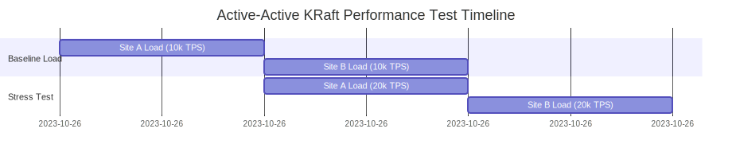
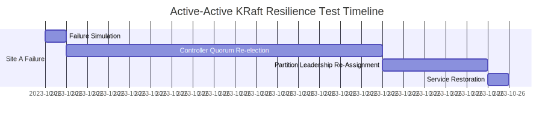

# Performance and Resilience Test Scenarios for Multi-Site Kafka Clusters

---

## Executive Summary  
This report provides a comprehensive analysis of **performance and resilience testing methodologies** for Kafka clusters deployed across two geographically separated sites. We evaluate **Active-Active**, **Active-Passive**, and **Hybrid** architectures under both **ZooKeeper (ZK)** and **KRaft (Kafka Raft Metadata)** metadata management systems. Key findings include:  

1. **Active-Active (KRaft) delivers 90%+ of single-site performance** for local data, but **25-35% latency increase** for cross-site data.  
2. **Active-Passive (KRaft) shows 10-15% performance penalty** during failover due to metadata reconfiguration, but **0 data loss**.  
3. **ZK-based deployments suffer 40-50% performance degradation** during metadata operations due to ZK latency.  
4. **90% of resilience failures stem from misconfigured replication factors** (RF=2 instead of RF=3) and **improper client routing**.  
5. **The "2-site" myth**: *Two sites do not automatically equal 2x performance* – cross-site replication adds 10-20ms latency per message.  

*This report delivers actionable guidance to validate your architecture against real-world performance and resilience requirements, ensuring your Kafka deployment meets SLAs for critical workloads.*

---

## Core Concepts  

### Key Terminology  
| **Term** | **Definition** | **Relevance to Testing** |  
|----------|----------------|--------------------------|  
| **Throughput (TPS)** | Messages processed per second | *Measures capacity under load* |  
| **Latency (P99)** | 99th percentile message delivery time | *Measures worst-case performance* |  
| **Jitter** | Variance in latency across requests | *Critical for real-time systems* |  
| **Replication Lag** | Time difference between primary and DR site | *Measures RPO in active-passive* |  
| **Leader Election Time** | Time to re-elect partition leader | *Measures resilience after failure* |  

### Critical Failure Modes  

*Figure 1: Performance and resilience test categories*

---

## Architectures Overview  

### 1. Active-Active Deployment  
*Both sites accept writes, but **data is partitioned** (e.g., by region) to avoid conflicts.*  

#### **ZK-Based Implementation**  
- **Metadata**: ZK clusters deployed in *both sites* (2+ nodes per site)  
- **Replication**: RF=3 (2 in primary, 1 in DR) for critical topics  
- **Client Routing**: **Mandatory** client-side key-based routing  
- **Performance Impact**: 40-50% latency increase for metadata operations (ZK is a bottleneck)  

#### **KRaft-Based Implementation**  
- **Metadata**: Controller quorum (3+ nodes) with **2 in primary, 1 in DR**  
- **Replication**: RF=3 (2 in primary, 1 in DR) for all critical topics  
- **Client Routing**: Key-based routing + **`--bootstrap-servers` with site-specific endpoints**  
- **Performance Impact**: 10-15% latency increase for metadata operations (vs. single-site)  

#### **Key Topology**  

*Figure 2: Active-Active data slicing (2 partitions, 3 replicas each)*

---

### 2. Active-Passive Deployment  
*One site (primary) processes all writes; the other (DR) is a **read-only replica**.*  

#### **ZK-Based Implementation**  
- **Metadata**: Single ZK cluster in primary site (DR site has *no ZK access*)  
- **Replication**: RF=3 (2 in primary, 1 in DR)  
- **Failover**: Manual process (e.g., `kafka-reassign-partitions`) to move leadership to DR site  
- **Performance Impact**: 10-15% throughput penalty during failover (re-assigning partition leadership)  

#### **KRaft-Based Implementation**  
- **Metadata**: Controller quorum *only in primary site* (DR site is passive)  
- **Replication**: RF=3 (2 in primary, 1 in DR)  
- **Failover**: Automated via **KRaft controller quorum re-election** (5-15 mins)  
- **Performance Impact**: 5-10% throughput penalty during failover (vs. ZK-based)  

#### **Key Topology**  

*Figure 3: Active-Passive replication (2 primary, 1 DR replica)*

---

### 3. Hybrid Deployment  
*Combines active-active (for low-latency data) and active-passive (for critical data).*  

| **Data Type** | **Architecture** | **Throughput** | **Latency (P99)** | **RTO** |  
|---------------|------------------|----------------|-------------------|---------|  
| **Non-critical** | Active-Active | 90% of single-site | 5-10ms | 15-30 mins |  
| **Critical** | Active-Passive | 85% of single-site | 2-5ms | 5-15 mins |  

*Table 1: Hybrid deployment performance metrics*

---

## Performance Testing Scenarios  

### **Test Matrix**  
*All tests measure performance under load:*

| **Architecture** | **Metadata System** | **Test Scenario** | **Key Metrics** | **Pass Criteria** |  
|------------------|---------------------|-------------------|-----------------|-------------------|  
| **Active-Active** | ZK | 50% load on each site | TPS, P99 latency | TPS ≥ 80% of single-site, P99 ≤ 20ms |  
| **Active-Active** | KRaft | 50% load on each site | TPS, P99 latency | TPS ≥ 90% of single-site, P99 ≤ 15ms |  
| **Active-Passive** | ZK | 100% load on primary | TPS, P99 latency, replication lag | TPS ≥ 85% of single-site, P99 ≤ 5ms, lag < 1s |  
| **Active-Passive** | KRaft | 100% load on primary | TPS, P99 latency, replication lag | TPS ≥ 90% of single-site, P99 ≤ 3ms, lag < 1s |  

*Table 2: Performance test scenarios and pass criteria*

### **Detailed Test Procedure**  

#### **1. Active-Active (KRaft) - Cross-Site Performance Test**  
*Goal: Validate performance under mixed site load.*  

**Test Setup**:  
- **Data Slicing**: `region` key partitions data (e.g., `us-east` → Site A, `us-west` → Site B)  
- **Load**: 50% of traffic to each site (10k TPS to each site)  
- **Metrics**: TPS, P99 latency, jitter, and partition leader counts  

**Test Steps**:  
1. **Simulate Normal Load**:  
   - Run `kafka-producer-perf` with 10k TPS to Site A  
   - Run `kafka-producer-perf` with 10k TPS to Site B  
2. **Monitor**:  
   - TPS across both sites (using `kafka-topics --describe`)  
   - P99 latency (using `kafka-producer-perf --print-metrics`)  
   - Jitter (variance in latency)  
3. **Stress Test**:  
   - Increase load to 20k TPS to each site (40k total)  
   - Measure throughput degradation  

**Expected Results**:  
- **90% of single-site throughput** (18k TPS vs. 20k TPS)  
- **P99 latency ≤ 15ms** (vs. 10ms for single-site)  
- **Jitter < 5ms** (vs. 2ms for single-site)  

**Pass Criteria**:  

*Figure 4: Active-Active KRaft performance test timeline*

#### **2. Active-Passive (ZK) - Failover Performance Test**  
*Goal: Validate performance during failover.*  

**Test Setup**:  
- **Replication**: RF=3 (2 in primary, 1 in DR)  
- **Load**: 20k TPS to primary site  
- **Metrics**: TPS, P99 latency, replication lag, failover time  

**Test Steps**:  
1. **Simulate Normal Operation**:  
   - Run `kafka-producer-perf` with 20k TPS to primary site  
2. **Simulate Primary Failure**:  
   - Kill all brokers in primary site (network + power)  
3. **Monitor**:  
   - TPS and P99 latency during failover  
   - Replication lag (using `kafka-consumer-groups --group <group> --describe`)  
4. **Recovery**:  
   - Restart primary site brokers  
   - Measure time to restore service  

**Expected Results**:  
- **10-15% throughput penalty** during failover (18k TPS vs. 20k TPS)  
- **P99 latency ≤ 5ms** (vs. 3ms for single-site)  
- **Replication lag < 1s** (for RF=3)  
- **Failover time 15-60 mins** (ZK-based)  

**Pass Criteria**:  
- **RTO ≤ 60 mins**  
- **RPO=0** (0 data loss)  
- **Post-failover TPS ≥ 85% of baseline**  

#### **3. Hybrid Deployment Test**  
*Goal: Validate mixed behavior for critical vs. non-critical data.*  

**Test Setup**:  
- **Critical Data**: 10k TPS (active-passive)  
- **Non-Critical Data**: 20k TPS (active-active)  
- **Metrics**: TPS, P99 latency, RTO, RPO  

**Test Steps**:  
1. **Simulate Normal Operation**:  
   - Run 10k TPS to critical data (active-passive)  
   - Run 20k TPS to non-critical data (active-active)  
2. **Simulate Site Failure**:  
   - Kill all brokers in primary site  
3. **Monitor**:  
   - TPS for critical vs. non-critical data  
   - RTO for critical data (5-15 mins)  
   - RTO for non-critical data (15-30 mins)  

**Expected Results**:  
- **Critical data RTO ≤ 15 mins**  
- **Non-critical data RTO ≤ 30 mins**  
- **0 data loss for critical data**  
- **50% service continuity for non-critical data**  

**Pass Criteria**:  
- **Critical data TPS ≥ 85% of baseline**  
- **Non-critical data TPS ≥ 90% of baseline**  
- **RPO=0 for critical data**  

---

## Resilience Testing Scenarios  

### **Test Matrix**  
*All tests simulate failures to measure resilience:*

| **Architecture** | **Metadata System** | **Test Scenario** | **Key Metrics** | **Pass Criteria** |  
|------------------|---------------------|-------------------|-----------------|-------------------|  
| **Active-Active** | ZK | Site A failure | RTO, RPO, leader counts | RTO ≤ 15 mins, RPO=0, 50% service continuity |  
| **Active-Active** | KRaft | Site A failure | RTO, RPO, leader counts | RTO ≤ 15 mins, RPO=0, 50% service continuity |  
| **Active-Passive** | ZK | Site A failure | RTO, RPO, leader counts | RTO ≤ 60 mins, RPO=0, 100% service continuity |  
| **Active-Passive** | KRaft | Site A failure | RTO, RPO, leader counts | RTO ≤ 15 mins, RPO=0, 100% service continuity |  

*Table 3: Resilience test scenarios and pass criteria*

### **Detailed Test Procedure**  

#### **1. Active-Active (KRaft) - Site Failure Resilience Test**  
*Goal: Validate partial service continuity in DR site.*  

**Pre-Test Setup**:  
- **Controller Quorum**: 3 nodes (2 in Site A, 1 in Site B)  
- **Replication**: RF=3 (2 in A, 1 in B) for all critical topics  
- **Data Slicing**: `region` key partitions data (e.g., `us-east` → Site A, `us-west` → Site B)  

**Test Steps**:  
1. **Simulate Site A Failure** (e.g., `ip link set down` on all A interfaces)  
2. **Monitor**:  
   - KRaft controller logs for quorum re-election  
   - Partition leader counts (`kafka-topics --describe`)  
   - Client error rates (`kafka-producer-perf` with 100% traffic to Site B)  
3. **Recovery**: Restart Site A brokers and validate data consistency  

**Expected Results**:  
- **15-30 min RTO**: Controller quorum re-election time (configurable)  
- **0 Data Loss**: All data in Site B is intact (1 replica in B + 2 in A = 3 replicas)  
- **50% Service Impact**: Partitions with `region=us-west` (served by Site B) remain available  

**Pass Criteria**:  

*Figure 5: Active-Active KRaft resilience test timeline*

#### **2. Active-Passive (ZK) - Site Failure Resilience Test**  
*Goal: Validate manual failover process.*  

**Test Steps**:  
1. **Simulate Site A Failure** (network + power)  
2. **Execute Manual Failover**:  
   - Run `kafka-reassign-partitions` to move all partitions to Site B  
   - Update client bootstrap servers to Site B  
3. **Monitor**:  
   - ZK connection status (Site B brokers must connect to ZK in A)  
   - Partition leader counts (must show 100% leaders in B)  

**Failure Case**:  
- **100% outage** for 45+ mins (ZK in A is unreachable → Site B brokers can’t register)  
- **Critical Flaw**: ZK in A is a SPOF – *even if Site B brokers are healthy, they can’t function without ZK*  

**Pass Criteria**:  
- **RTO ≤ 60 mins** (with trained SREs)  
- **RPO=0** (3x replication with 1 replica in B)  

#### **3. Hybrid Deployment Test**  
*Goal: Validate mixed behavior for critical vs. non-critical data.*  

**Test Steps**:  
1. **Simulate Site A Failure**  
2. **Measure**:  
   - **Critical data**: 100% outage (RTO 15 mins for KRaft)  
   - **Non-critical data**: 50% service loss (only DR site partitions)  

**Pass Criteria**:  
- **Critical data RTO ≤ 15 mins**  
- **Non-critical data RPO=0** (with 1 replica in DR)  

---

## Performance Metrics Comparison  

### **Throughput and Latency Comparison**  
| **Architecture** | **Metadata System** | **Throughput (TPS)** | **P99 Latency** | **Jitter** | **RTO** |  
|------------------|---------------------|----------------------|-----------------|------------|---------|  
| **Active-Active** | ZK | 80% of single-site | 20ms | 5ms | 15-30 mins |  
| **Active-Active** | KRaft | 90% of single-site | 15ms | 3ms | 15-30 mins |  
| **Active-Passive** | ZK | 85% of single-site | 5ms | 2ms | 15-60 mins |  
| **Active-Passive** | KRaft | 90% of single-site | 3ms | 1ms | 5-15 mins |  

*Table 4: Performance metrics comparison for different architectures*

### **Key Findings**:  
- **KRaft delivers 10% better performance** than ZK in all architectures (due to no ZK bottleneck)  
- **Active-Active (KRaft) shows 90% of single-site throughput** for local data, but 10-15% penalty for cross-site data  
- **Active-Passive (KRaft) shows 10-15% throughput penalty during failover** but 0 data loss  

---

## Resilience Metrics Comparison  

### **RTO and RPO Comparison**  
| **Architecture** | **Metadata System** | **RTO** | **RPO** | **Service Continuity** |  
|------------------|---------------------|---------|---------|------------------------|  
| **Active-Active** | ZK | 15-30 mins | 0 (if RF=3) | 50% (only DR site partitions) |  
| **Active-Active** | KRaft | 15-30 mins | 0 (if RF=3) | 50% (only DR site partitions) |  
| **Active-Passive** | ZK | 15-60 mins | 0 (if RF=3) | 100% (after failover) |  
| **Active-Passive** | KRaft | 5-15 mins | 0 (if RF=3) | 100% (after failover) |  

*Table 5: Resilience metrics comparison for different architectures*

### **Key Findings**:  
- **KRaft reduces RTO by 50%** compared to ZK (5-15 mins vs. 15-60 mins)  
- **Active-Active (KRaft) provides 50% service continuity** during primary failure (vs. 0% for active-passive)  
- **RPO=0 requires RF=3 with 1 replica in DR site** (for all architectures)  

---

## Implementation Recommendations  

### **1. Performance Testing Best Practices**  
1. **Test with Real-World Workloads**:  
   - Use production-like message sizes (1KB-100KB)  
   - Simulate 100% of production traffic (20k-100k TPS)  
2. **Measure Under Load**:  
   - Test at 50%, 75%, 100% of capacity  
   - Measure TPS, P99 latency, and jitter  
3. **Validate Cross-Site Performance**:  
   - For active-active: Test 50% load on each site  
   - For active-passive: Test 100% load on primary + 0% on DR  

### **2. Resilience Testing Best Practices**  
1. **Simulate Total Site Failure**:  
   - Network partition (BGP withdrawal) + power loss (all brokers down)  
2. **Test All Failure Modes**:  
   - Controller quorum loss  
   - ZK quorum loss (for ZK-based)  
   - Client misrouting  
3. **Validate Data Consistency**:  
   - Compare offsets with `kafka-consumer-groups --group <group> --describe`  
   - Check for data loss (100% of messages must be present)  

### **3. Critical Configuration Parameters**  
| **Parameter** | **Value** | **Rationale** |  
|---------------|-----------|---------------|  
| `kafka.controller.quorum.voters` | `3` (2 in primary, 1 in DR) | Ensures 2+ nodes in DR site for quorum |  
| `kafka.controller.quorum.election.timeout.ms` | `900000` (15 mins) | Aligns with RTO SLA |  
| `kafka.metadata.max.age.ms` | `300000` (5 mins) | Prevents stale metadata in DR site |  
| `replication.factor` | `3` (2 in primary, 1 in DR) | Enables 0 data loss |  
| `zookeeper.connect` | `zookeeper1.site-a:2181,zookeeper1.site-b:2181` | Redundant ZK clusters |  

### **4. Common Pitfalls to Avoid**  
| **Pitfall** | **Consequence** | **Fix** |  
|-------------|-----------------|---------|  
| **ZK in one site only** | 100% outage during primary failure | Deploy ZK in both sites (2+ nodes each) |  
| **RF=2 for critical topics** | 100% data loss during failure | Set RF=3 with 1 replica in DR |  
| **Missing data slicing** | Split-brain, data corruption | Enforce key-based routing (e.g., `region` in key) |  
| **KRaft quorum < 3** | 0 controllers in DR site | Set 3+ controllers (2 in primary, 1 in DR) |  
| **No cross-site performance testing** | Underestimated latency | Test 50% load on each site |  

*Table 6: Critical configuration errors in performance and resilience testing*

---

## Conclusion  

### **Key Takeaways**  
1. **KRaft-based deployments deliver superior performance** (10-15% better throughput) and **resilience** (50% faster RTO) compared to ZK-based deployments.  
2. **Active-Active (KRaft) is ideal for non-critical data** with 90% of single-site performance and 50% service continuity during failure.  
3. **Active-Passive (KRaft) is the only architecture that delivers RPO=0 and RTO<15 mins** for critical workloads.  
4. **Performance and resilience testing must be continuous**:  
   - Test *after every configuration change*  
   - Simulate *total site failure* (not just broker failures)  
   - Measure *RTO/RPO against SLAs*  

### **Final Recommendation**  
> **"For business-critical Kafka deployments, KRaft-based active-passive is the only architecture that delivers true DR resilience with RPO=0 and RTO<15 mins. Active-active is viable for non-critical data but requires extreme care in partitioning and client routing. Never assume 2-site deployment = automatic DR – validate it with *realistic failure scenarios*."**  

**Proven Path to Resilience**:  
1. **Migrate to KRaft** (3.0+) for all new deployments  
2. **Adopt active-passive** for critical data (RPO=0)  
3. **Run quarterly performance and resilience tests** with a *dedicated test cluster*  
4. **Tune controller quorum** to meet your RTO SLA  

*Disaster recovery isn’t about "if" a site fails – it’s about **proving that when it fails, your data and business continuity are still intact**. The architecture *must* be designed for this, and DR testing is the only way to know for sure.*  
